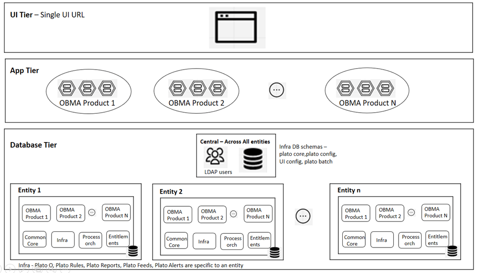
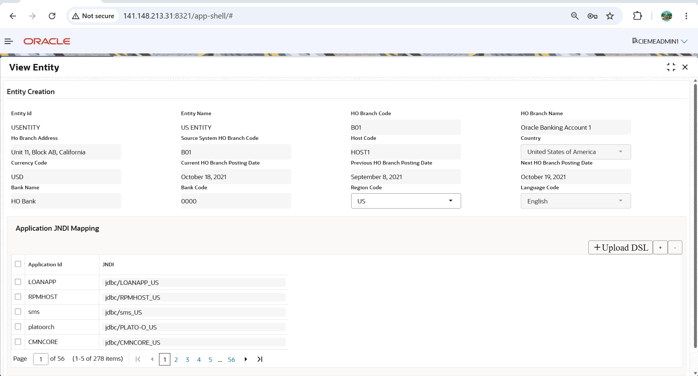
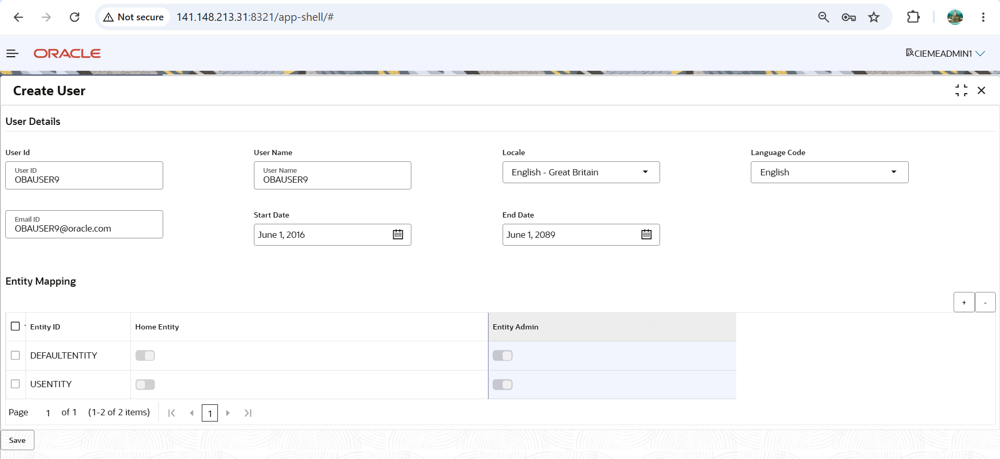

# Oracle Banking Multi-Entity Deployment Guide

## Contents

1. [Why Multi-Entity is Needed](#1-Why-Multi-Entity-is-Needed)
2. [Deployment Diagram](#2-Deployment-Diagram)
3. [Pre-Requisites to Enable Multi-Entity](#3-Pre-Requisites-to-Enable-Multi-Entity)
4. [Enable Multi-Entity Configuration](#4-Enable-Multi-Entity-Configuration)
5. [Replicate Existing Users for DEFAULTENTITY](#5-Replicate-Existing-Users-for-DEFAULTENTITY)
6. [Create a New Entity](#6-Create-a-New-Entity)
7. [View Entities](#7-View-Entities)
8. [Additional Checks and Configuration](#8-Additional-Checks-and-Configuration)
9. [Create User](#9-Create-User)
 

---

# 1. Why Multi-Entity is Needed?

Many banks operate through multiple branches, subsidiaries, or legal entities. Each entity may have its own customers, users, products, and business rules, but all of them belong to the same banking group.

Instead of deploying and maintaining a separate application for each entity, Oracle Banking Multi-Entity allows all entities to use a single application deployment while keeping their data and configurations logically separate.

---------------------

# 2. Deployment Diagram



### 1. UI Tier

The UI (User Interface) is shared across all entities.

- A single application URL is used for all entities.
- Users can belong to one or more entities.
- Every user has one Home Entity.
- After login, the user is automatically redirected to the Home Entity.
- If the user has access to multiple entities, they can switch between them without logging out.
- A Multi-Entity Administrator can create and manage entities.

#### Example

```
http://<server>/app-shell
                │
                ├── DEFAULTENTITY
                ├── USENTITY
                └── UKENTITY
```

### 2. Application Tier

The Application Tier is also shared across all entities.

A single set of Oracle Banking microservices serves all entities, including:

- Infrastructure Services
    - Plato Discovery
    - API Gateway
    - Batch Services
    - Config Services
- SMS (Security Management Service)
- Common Core Services
- Product Services
  - OBA
  - OBRL
  - OBTFPM
  - OBLM
  - OBVAM
  - Other Oracle Banking products

Each request contains an Entity ID in the request header. Based on this Entity ID, the application connects to the corresponding database schema for processing.

### 3. Database Tier

Data separation is achieved at the database level.

Each entity has its own database schemas to ensure complete data isolation.

**Shared Across All Entities:**

- LDAP / OUD Users
- Plato Schema
- Plato UI Configuration Schema
- Plato Batch Schema
- Plato Security Schema

**Entity-Specific**

The following schemas are maintained separately for each entity:

- Conductor
- Plato Rules
- Plato Reports
- Plato Feeds
- Plato Alerts
- SMS Schema
- Common Core Schema
- Product-specific Schemas

This ensures that users from one entity cannot access the business data of another entity.

### Overall Flow

```
                 User
                   │
                   ▼
            Shared UI (App Shell)
                   │
                   ▼
          Shared Application Tier
      (API Gateway, SMS, Microservices)
                   │
        Entity ID/ Region Code in Request Header
                   │
        ┌──────────┴──────────┐
        ▼                     ▼
 DEFAULTENTITY DB        USENTITY DB
      │                      │
      ▼                      ▼
 Entity-specific Data   Entity-specific Data
```
--------------------

# 3. Pre-Requisites to Enable Multi-Entity

### 3.1. Database
   
- Separate database schemas are created for each business entity (for example, DEFAULTENTITY and USENTITY).
- Required database users and privileges are granted.

For a Multi-Entity setup, the database is separated by region/entity. In our case, RW and US are the regions for each entity.

#### 3.1.1 Common PDB

This PDB contains schemas that are shared across entities.

- PDB Name: COMMONPDB
- Schema List: CD0_PLATOUI, CD0_PLATO, CD0_PLATOBATCH, CD0_PLATOSEC
- Tablespace: COMMONENTITYTBS
- Used for: Plato UI config, Plato core/config, Plato Batch, PLATO Security.

#### 3.1.2. DEFAULTENTITY (RW) entity PDBs

These PDBs are used for the RW region.

- COMMON_ROW -> common schemas for ROW
- OBA_ROW -> OBA-related schemas for ROW
- RETAIL_ROW -> retail/corporate related schemas for ROW
- OBOLRL_ROW -> OBOL and OBRL related schemas for ROW

#### 3.1.3. US entity PDBs

These PDBs are used for the US region.

- COMMON_US -> common Schemas for US
- OBA_US -> OBA-related schemas for US
- RETAIL_US -> retail/corporate related schemas for US
- OBOLRL_US -> OBOL and OBRL related schemas for US

**Simple explanation::**

- Common schemas are used by both entities.
- ROW schemas/PDBs store ROW-specific application data.
- US schemas/PDBs store US-specific application data.

The application uses the entity/region in the request header to decide which schema to use.


### 3.2  Ensure the application is up and running with the default entity, and verify that users are able to log in successfully.

-----------------

# 4. Enable Multi-Entity Configuration

## 4.1 Enable the Multi-Entity Property

Add the following property to the `setenv.sh` file of all Tomcat servers (or the managed server startup configuration if WebLogic is used):

multi.entity.enabled=true

**Note:**
- Ensure this property is configured on all managed servers hosting Oracle Banking services.

---

## 4.2 Configure Multi-Entity Administrator Users

Oracle Banking provides two predefined Multi-Entity Administrator users:

- MEADMIN1
- MEADMIN2

These users are automatically created as part of the Flyway/Liquibase database migration.

### Responsibilities

The Multi-Entity Administrator users are used to:
- Create new business entities.
- View existing entities.
- Modify entity configurations.
- Create and manage users across entities.

### Database Information

The user-to-entity mapping for these administrator users is maintained in the following table:

> PLATO_SECURITY.PLATO_TM_USER_ENTITY_MAPPING

### Important Notes

- MEADMIN1 and MEADMIN2 are system administrator users used exclusively for Multi-Entity administration.
- These users are not associated with any specific entity or branch.
- They are different from regular SMS application users and should not be used as business users.
- Before logging in, configure passwords for MEADMIN1 and MEADMIN2 in LDAP/OUD, as authentication is performed through the configured LDAP user store.
- Use these accounts only for Multi-Entity administration tasks, such as creating entities and provisioning users. Regular business users should continue to use their respective entity-specific accounts.

-----
# 5. Replicate Existing Users for DEFAULTENTITY

Ensure that all existing users from the Single-Entity environment are available in the Multi-Entity setup.

## Why is this Required?

After enabling Multi-Entity, the existing users must be associated with the **DEFAULTENTITY** so they can continue to log in and access the application without interruption.

## User Replication

Replicate all existing application users from the Single-Entity environment to the Multi-Entity framework.

> **Note:** Do not perform direct database inserts into the PLATO Security tables.

The recommended approach is to recreate the users using the **MEADMIN1** or **MEADMIN2** user through the **Create User** screen (or the supported APIs).

During user creation:

- Select **DEFAULTENTITY** as the Entity.
- Mark **DEFAULTENTITY** as the Home Entity.
- Save the user.

This process automatically populates all the required Multi-Entity security tables.

## LDAP/OUD Configuration

After recreating the users in the application:

- Create the corresponding users in LDAP/OUD (if they do not already exist).
- Configure or update the user passwords.
- Verify LDAP authentication.

## Validation

Verify the following:

- Existing users can log in successfully.

-----
# 6. Create a New Entity

After completing the Multi-Entity configuration, log in using a Multi-Entity Administrator user (MEADMIN1 or MEADMIN2) to create a new business entity.

## Steps

1. Log in to the application using **MEADMIN1** or **MEADMIN2**.
2. Navigate to **Entities** → **Create Entity**.
3. Enter the required entity details.

### Mandatory Fields

- Entity ID
- Entity Name
- Head Office (HO) Branch Code
- Head Office (HO) Branch Name
- Head Office (HO) Branch Address
- Host Code
- Country
- Current HO Branch Posting Date
- Previous HO Branch Posting Date
- Next HO Branch Posting Date
- Bank Name
- Bank Code

## Configure Application JNDI Mapping

Each application must be mapped to the appropriate JNDI datasource configured on the application server.

For every application:

- Select the **Application ID**.
- Specify the corresponding **JNDI**.
- Click **+** to add additional mappings.
- Click **-** to remove an existing mapping.

Alternatively, all mappings can be uploaded using the **Upload DSL** option.

### Sample DSL

```json
[
  {
    "appId": "CMNCORE",
    "jndi": "jdbc/CMNCORE_US"
  },
  {
    "appId": "SMS",
    "jndi": "jdbc/SMS_US"
  },
  {
    "appId": "SECSRV001",
    "jndi": "jdbc/PLATO_SECURITY"
  },
  {
    "appId": "UICFGSRV001",
    "jndi": "jdbc/PLATO_UI_CONFIG"
  },
  {
    "appId": "OBA",
    "jndi": "jdbc/OBA_US"
  }
]
```

4. After configuring all JNDI mappings, click **Save**.

The new entity is created successfully and can be viewed from **Entities → View Entity**.



## What Happens After Saving the Entity?

The application automatically updates the following tables:

- PLATO.SECURITY.PLATO_TM_ENTITY (stores entity information)
- PLATO.APPLICATION_LEDGER (stores Application ID and JNDI mappings)

### Entity Administrator Role

A new role named **ENTITY_ADMIN_ROLE** is automatically created for the new entity.

This role is created in:

- SMS_TM_ROLE
- SMS_TW_ROLE
- SMS_TM_ROLE_ACTIVITY
- SMS_TW_ROLE_ACTIVITY

This role is assigned later while creating the Entity Administrator user.

### Head Office and Bank Information

The following information is automatically inserted:

- Head Office Branch
- Bank Details
- System Dates

---

## Notes

- Ensure all JNDI mappings are configured with the correct datasource names for the new entity.
- Update the `server.xml` and `context.xml` files on all Tomcat servers to add the required datasource definitions for the new entity. Configure the new JNDI names, database username, password, PDB/service name, and connection URL as applicable.

```
<Resource   name="jdbc/sms" auth="Container"
		type="javax.sql.DataSource" driverClassName="oracle.jdbc.OracleDriver"
		url="jdbc:oracle:thin:@//10.12.60.92:1521/COMMON_ROW.mumbbankingpri.mumbbankingdb.oraclevcn.com"
		username="CD0_SMS" password="FinXGsH@123!" maxTotal="20" maxIdle="10"
		maxWaitMillis="-1"/>

<Resource   name="jdbc/sms_US" auth="Container"
		type="javax.sql.DataSource" driverClassName="oracle.jdbc.OracleDriver"
		url="jdbc:oracle:thin:@//10.12.60.92:1521/COMMON_US.mumbbankingpri.mumbbankingdb.oraclevcn.com"
		username="CD0_SMS" password="FinXGsH@123!" maxTotal="20" maxIdle="10"
		maxWaitMillis="-1"/>

```
- Restart all Tomcat servers after updating the datasource configuration.
- Verify that the Flyway/Liquibase scripts have been executed successfully for all entity-specific schemas before proceeding.

----

# 7. View Entities

After creating a new entity, you can verify its details using the **View Entities** screen.

## Steps

1. Log in to the application with a user having Multi-Entity administration privileges (for example, **MEADMIN1** or **MEADMIN2**).
2. Navigate to **Entities** → **View Entities**.
3. The **View Entities** screen displays the list of all configured entities.
4. Select the required entity to view its details.

## Information Displayed

The View Entities screen provides the following information for each entity:

- Entity ID
- Entity Name

Additional details can also be viewed based on the configured entity, such as the Head Office Branch, Bank details, Region Code, and JNDI mappings.

-------
# 8.  Additional Checks and Configuration

## 8.1. Verify Application Ledger Entries

Verify that the `APPLICATION_LEDGER` table contains an entry for the following application for **every configured entity**:

- **Application ID:** `UICFGSRV001`
- **Application Name:** `PLATO-UI-CONFIG-SERVICES`

For example, if the environment contains two entities (`DEFAULTENTITY` and `USENTITY`), the `APPLICATION_LEDGER` table must contain **two separate entries**, one for each entity, even though both entries point to the same shared `PLATO_UI` schema.

Example:

| Entity ID     | Application ID | Application Name         |
|---------------|----------------|--------------------------|
| DEFAULTENTITY | UICFGSRV001    | PLATO-UI-CONFIG-SERVICES |
| USENTITY      | UICFGSRV001    | PLATO-UI-CONFIG-SERVICES |

> **Note:** Although the `PLATO_UI` schema is shared across all entities, the corresponding `APPLICATION_LEDGER` entry must exist for each entity individually. If this entry is missing, the `uiConfig` API may return **HTTP 204 (No Content)**, resulting in a blank application screen after login.

## 8.2 Conductor Configuration

Conductor uses the `config.properties` file for its configuration. To enable Multi-Entity support, update the file with the following properties:

```properties
multi.entity.enabled=true
conductor.entity.list=DEFAULTENTITY~jdbc/PLATO-O,USENTITY~jdbc/PLATO-O_US
```

### Property Description

- **multi.entity.enabled=true**
  - Enables Multi-Entity support for the Conductor service.

- **conductor.entity.list**
  - Maps each configured entity to its corresponding Conductor datasource (JNDI).
  - The format is:
    ```
    <Entity_ID>~<JNDI_Name>
    ```
  - Add an entry for every configured entity in the environment.

### Example

| Entity        | Conductor JNDI  |
|---------------|-----------------|
| DEFAULTENTITY | jdbc/PLATO-O    |
| USENTITY      | jdbc/PLATO-O_US |

----

----

# 9. Create User

After creating the entity, the next step is to create users and map them to one or more entities.

## Steps

1. Log in to the application using a Multi-Entity Administrator user (for example, **MEADMIN1** or **MEADMIN2**).
2. Navigate to **Users** → **Create User**.
3. Enter the required user details.

### Mandatory Fields

- User ID
- User Name
- Locale
- Email ID
- Start Date
- End Date
- Entity ID

### Entity Mapping

Assign the user to one or more entities.

- Select the required **Entity ID**.
- Select one entity as the **Home Entity**.
- Enable the **Entity Admin** option if administrative privileges are required.
- Click **+** to add additional entity mappings.

> **Note:** A user can belong to multiple entities; however, only one entity can be configured as the **Home Entity**. During login, the user is automatically redirected to the Home Entity and can switch to other assigned entities.



### Entity Administrator

Enable the **Entity Admin** option only for users who need to administer an entity.

An Entity Administrator can perform the following activities:

- Create and Modify Branches
- Create and Modify Hosts
- Create and Modify Roles
- Create and Modify Business Users
- Define User–Role–Branch Mapping
- Define Role–Function Activity Mapping
- Define User Group–Role Mapping

4. Click **Save** to create the user.

The user is successfully created and can be viewed from **Users → View Users**.

---

# User Creation Flow

The user creation process involves three components:

1. Oracle Banking (Multi-Entity User)
2. LDAP / OUD
3. SMS User Management

All three steps must be completed before the user can access the application.

---

## Step 1 – Create the Multi-Entity User

Creating a user from the **Users → Create User** screen creates a Multi-Entity user.

These users are **not SMS Business Users**.

The user information is stored in the **PLATO_SECURITY** schema.

The following tables are updated:

- PLATO_TM_ENTITY_USER_MAPPING
- SECURITY_SMS_USER_MAPPING

These tables maintain the user-to-entity mapping used by the Multi-Entity framework.

---

## Step 2 – Create the User in LDAP/OUD

After creating the Multi-Entity user, create the same user in **LDAP/OUD**.

Configure:

- User ID
- Password
- Required LDAP attributes

> **Note:** Oracle Banking authenticates users through LDAP/OUD. If the user is not available in LDAP/OUD, login will fail even if the user exists in the PLATO_SECURITY schema.

---

## Step 3 – Create the SMS Business User

Once the LDAP user is created, navigate to:

**SMS → User Maintenance → Create User**

The User ID created in the Multi-Entity screen will now be available in the **User ID** search field.

Select the required User ID.

Assign:

- Branch
- Role
- User Group (if applicable)

Save the SMS user.

Only after completing the SMS user configuration will the user be able to perform business operations in Oracle Banking.

---

# Entity Admin Behaviour

If the **Entity Admin** option is enabled while creating the user, Oracle Banking automatically assigns the **ENTITY_ADMIN** role.

The role information is maintained in the following SMS tables:

- SMS_TM_ROLE
- SMS_TW_ROLE
- SMS_TM_ROLE_ACTIVITY
- SMS_TW_ROLE_ACTIVITY

The ENTITY_ADMIN role provides the following privileges:

- Create / Modify Branch
- Create / Modify Host
- Create / Modify Role
- Create / Modify Business Users
- Define User–Role–Branch Mapping
- Define Role–Function Activity Code Mapping
- Define User Group–Role Mapping

> **Note:** Enable the **Entity Admin** option only for users responsible for administering an entity. Regular business users should be created without this option enabled.

---

# Validation

Verify the following after creating the user:

✓ User is available in **PLATO_TM_ENTITY_USER_MAPPING**

✓ User is available in **SECURITY_SMS_USER_MAPPING**

✓ User exists in **LDAP/OUD**

✓ User is available in **SMS User Maintenance**

✓ Required Branch and Role are assigned

✓ User can successfully log in to the application

✓ User can access the assigned Home Entity

✓ Entity switching works correctly (if multiple entities are assigned)


