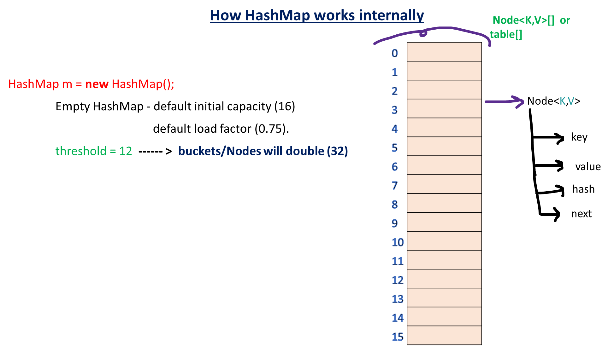
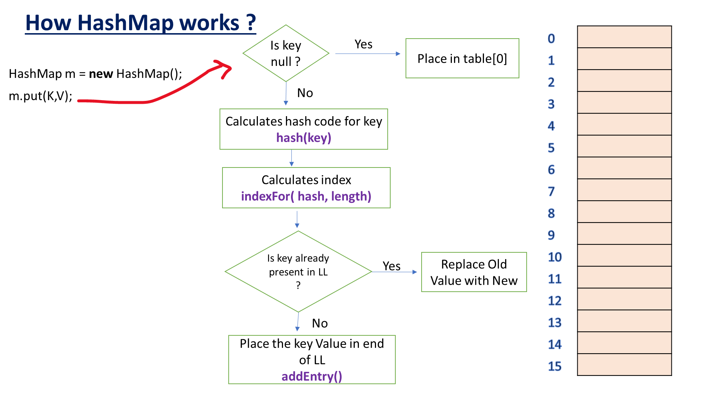
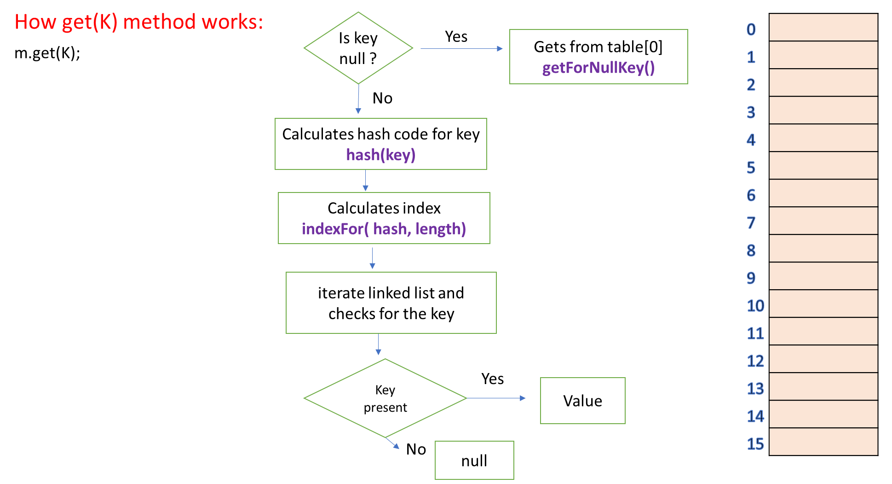

# HashMap

## Overview

- `HashMap` stores data as **key-value pairs**
- Keys are **unique**
- Values can be duplicated
- Not synchronized (not thread-safe)
- Allows:
    - One `null` key
    - Multiple `null` values

---

## Key Characteristics

| Feature | Description |
|--------|------------|
| **Structure** | Array of buckets |
| **Duplicates** | Keys not allowed |
| **Order** | Not guaranteed |
| **Thread Safety** | No |
| **Performance** | O(1) average |

---

## Constructors

| Constructor | Description |
|------------|------------|
| `HashMap()` | Default capacity (16) and load factor (0.75) |
| `HashMap(int initialCapacity)` | Creates map with specified initial capacity |
| `HashMap(int initialCapacity, float loadFactor)` | Custom capacity and load factor |
| `HashMap(Map<? extends K, ? extends V> m)` | Creates map with entries from another map |

---

## How HashMap Works Internally 

## put method internal

## get method internal

----------------

### Time Complextity

| Operation | Average | Worst Case |
| --------- | ------- | ---------- |
| Put       | O(1)    | O(log n)   |
| Get       | O(1)    | O(log n)   |
| Remove    | O(1)    | O(log n)   |

## Important Concepts

1. hashCode() + equals()
   
- hashCode() → bucket selection
- equals() → key comparison

2. Capacity is always rounded to power of 2

Actual threshold:
- threshold = capacity * loadFactor

