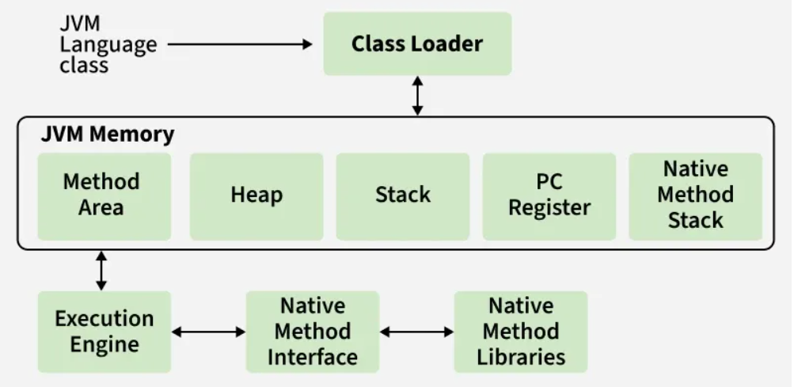

# JVM Architecture

**JVM (Java Virtual Machine)** is a virtual machine that:

- Handles **class loading**
- Manages **memory**
- Executes Java **bytecode**
- Provides **platform independence**

> Java code is written once and runs anywhere because of JVM.

---

JVM consists of **four main components**:

1. Class Loader Subsystem
2. Runtime Data Areas (Memory)
3. Execution Engine
4. Native Interface & Native Libraries

---

## 1️⃣ Class Loader Subsystem

- Loads `.class` files into JVM
- Converts bytecode into JVM internal format

### Steps involved
1. **Loading**
    - Reads .class files and stores class metadata in the Method Area.
    - Creates a Class object in the heap representing the loaded class.

2. **Linking** : Responsible for preparing the loaded class for execution. It includes three steps:
    
    - **Verification** → Ensures the bytecode follows JVM rules and is safe to execute.
    - **Preparation** → allocates memory for static variables
    - **Resolution** → Converts symbolic references into direct references in memory.

3. **Initialization**
    - Executes static blocks
    - Assigns actual static values

### Types of Class Loaders
- **Bootstrap ClassLoader** → Loads core Java classes (JAVA_HOME/lib).
- **Extension / Platform ClassLoader**  → Loads classes from extensions directory (JAVA_HOME/jre/lib/ext).
- **Application ClassLoader** → Loads classes from the application classpath.

> JVM follows **Parent Delegation Model**

---

## 2️⃣ Runtime Data Areas (Memory)

This is where data is stored while the program runs.

### 2.1 Method Area (Shared)

Stores:
- Class metadata
- Static variables
- Method bytecode
- Runtime constant pool

✔ Shared across all threads

### 2.2 Heap (Shared)

Stores:
- Objects
- Arrays

Characteristics:
- Shared across threads
- Managed by **Garbage Collector**
- Large memory area
- Can cause **OutOfMemoryError**

> Objects created using `new` are stored in heap.

### 2.3 Stack (Thread-Specific)

Stores:
- Method calls
- Local variables
- Method parameters
- Reference variables

Characteristics:
- One stack per thread
- Fast access
- Follows **LIFO**
- Can cause **StackOverflowError**

> Stack stores execution context, not objects.

### 2.4 PC Register (Thread-Specific)

Stores:
- Address of the current instruction being executed

Used by JVM to know:
- Which instruction to execute next

### 2.5 Native Method Stack

Stores:
- Native (C/C++) method calls

Used when Java interacts with OS-level code.

---

## 3️⃣ Execution Engine

Execution engine executes the **.class** (bytecode).   
It reads the byte-code line by line, uses data and information present in various memory area and executes instructions.    
It can be classified into three parts:

### Components

#### a) Interpreter
- Executes bytecode line by line
- Slower
- Faster startup

#### b) JIT Compiler (Just-In-Time)
- Converts frequently executed bytecode into native machine code
- Improves performance

#### c) Garbage Collector
- Removes unused objects from heap
- Runs automatically
- Frees memory

> JVM first interprets code, then JIT optimizes hot code.

---

## 4️⃣ Native Interface & Libraries

### Java Native Interface (JNI)
- Allows Java to call native code (C/C++)
- Used for system-level operations

### Native Libraries
- Platform-specific libraries

---

## JVM Execution Flow

1. Java source code is compiled into bytecode
2. Class Loader loads the class
3. Memory is allocated in runtime data areas
4. Execution Engine runs the bytecode
5. Garbage Collector cleans unused objects
6. Native calls handled via JNI

---

- **Stack** → Method calls
- **Heap** → Objects
- **Method Area** → Class info and static variables

---

> **JVM loads classes using ClassLoader, stores data in runtime memory areas, executes bytecode using Execution Engine, and manages memory using Garbage Collector.**
